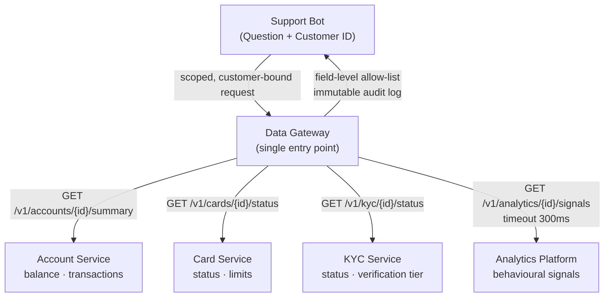

# Part 2 — Scalable, Governed Data Layer

## The problem

Today the bot reads customer data by scraping other microservices' logs out of a log store. This is:

- **Brittle:** Log formats change without notice. Fields get renamed.
- **Ungoverned:** Any service can see any customer's data. There is no access contract.
- **Stale:** Logs are behind real time. The bot may answer with yesterday's balance.
- **Unauditable:** No record of what data the bot read for which customer at what time.

---

## Proposed architecture



ASCII version (readable in plain text diffs):

```
┌─────────────────────────────────────────────────────────┐
│                    Support Bot                          │
│                                                         │
│  Question + Customer ID                                 │
│         │                                               │
│         ▼                                               │
│  ┌─────────────────┐                                    │
│  │  Data Gateway   │  ← single entry point for all data │
│  └────────┬────────┘                                    │
│           │  scoped, customer-bound requests            │
└───────────┼─────────────────────────────────────────────┘
            │
     ┌──────┴───────────────────────────────┐
     │              │             │         │
     ▼              ▼             ▼         ▼
┌─────────┐  ┌──────────┐  ┌──────────┐  ┌──────────────┐
│ Account │  │   Card   │  │   KYC    │  │  Analytics   │
│ Service │  │ Service  │  │ Service  │  │  Platform    │
│(balance,│  │(status,  │  │(status,  │  │(behavioural  │
│ txns)   │  │ limits)  │  │ docs)    │  │ signals)     │
└─────────┘  └──────────┘  └──────────┘  └──────────────┘
```

---

## Who owns what data and how it is exposed

Each service owns its domain and exposes it through a versioned, authenticated REST or gRPC endpoint — not logs.

| Data | Owning service | Endpoint example |
|------|---------------|------------------|
| Balance, transactions | Account Service | `GET /v1/accounts/{id}/summary` |
| Card status, limits | Card Service | `GET /v1/cards/{customerId}/status` |
| KYC status, verification tier | KYC Service | `GET /v1/kyc/{customerId}/status` |
| Behavioural analytics | Analytics Platform | `GET /v1/analytics/{customerId}/signals` |

Services do not share databases. They own their schema. The bot never calls a service's internal DB.

---

## The Data Gateway: guaranteeing the bot never reads the wrong customer's data

The Data Gateway is the single component the bot talks to. It:

1. **Binds every request to a customer ID.** The bot passes the authenticated `customer_id`; the gateway stamps it on every downstream call. A service call without a valid customer binding is rejected.

2. **Enforces a field-level allow-list.** Each service declares which fields the bot is permitted to read. The gateway strips anything not on the list before returning data to the bot. New fields added to a service's API are invisible to the bot until explicitly added to the allow-list.

3. **Prevents cross-customer leakage.** The gateway validates that the `customer_id` in the request matches the token/session before dispatching. A bot bug that passes the wrong ID is caught here, not downstream.

4. **Logs every data access.** Customer ID, field names accessed, timestamp, and the bot session ID are written to an immutable audit log. This is the compliance record.

---

## What happens when a service is slow or down mid-answer

The gateway uses a **tiered degradation** strategy:

**Tier 1 — Non-critical signals (analytics):**  
Timeout after 300 ms, return empty. The bot answers without behavioural context. This is acceptable — the core answer still works.

**Tier 2 — Supporting data (KYC, card status):**  
Timeout after 500 ms, return a cached value (TTL: 60 seconds) if available, or a "data unavailable" marker. The bot answers with what it has and notes that some information could not be retrieved.

**Tier 3 — Core data (balance, transactions):**  
Timeout after 1 second. If the Account Service is down and no cache is available, the bot returns: *"I'm unable to retrieve your account information right now. Please try again in a moment or contact support."* It does not escalate or guess.

**Why not always cache everything?** Financial data (balance, transactions) must be fresh. A cached balance from an hour ago could be materially wrong after a payment. Cache TTL for financial data is short (60 seconds) and should only be used as a brief circuit-breaker, not as the primary read path.

---

## Data residency for financial data

All services storing financial data (Account, Card, KYC) must:

- Store data in the declared residency region (e.g. Pakistan, EU). The gateway enforces this by routing requests to the correct regional endpoint based on the customer's registered region, stored in an identity service.
- Never replicate financial records to a region not covered by the customer's consent.
- Analytics data (behavioural signals) is anonymised before cross-region aggregation.

The Data Gateway itself is deployed per region. A Pakistani customer's request never leaves Pakistani infrastructure for the data-fetch phase.

---

## How a new data signal gets added

Contract-first: the owning service defines the new field in its API schema and publishes it. The gateway team reviews and adds it to the bot's allow-list. The bot can then request it by name.

This means:
- Services can evolve their APIs freely. The bot only sees what is explicitly allowed.
- Adding a new signal is a two-step process: service ships it, gateway approves it. No silent expansion of data access.
- Removing a signal requires a deprecation notice from the service, not a bot code change.

---

## How it scales as services and AI use-cases multiply

**Today:** One bot, four services, one gateway.

**As it grows:**

- **New AI use-cases** (fraud detection bot, onboarding assistant) each get their own allow-list in the gateway. They access the same services but see only the fields relevant to their use-case. The Account Service does not need to change when a new bot is added.

- **New services** register with the gateway and declare their field schema. They are invisible to all existing bots until explicitly allowed.

- **Concurrency:** The gateway fans out calls to multiple services in parallel (not serially). Response time is bounded by the slowest non-tiered service, not the sum of all services.

- **Rate limiting:** The gateway enforces per-customer and per-bot rate limits. A runaway bot cannot DoS the Account Service.

---

## Trade-offs and deliberate deferrals

| Decision | Trade-off | Deferred because |
|----------|-----------|-----------------|
| Gateway as single entry point | Adds a network hop, becomes a critical path dependency | Unavoidable — the alternative (bots calling services directly) gives up all governance |
| Field-level allow-list in gateway | Slows down adding new signals (requires gateway approval) | The governance benefit outweighs the velocity cost for financial data |
| Short cache TTL for financial data | Higher load on Account Service | Incorrect balance is worse than a slow response |
| Regional gateway deployment | Operational overhead | Required for residency compliance |
| Analytics timeout at 300ms | Behavioural signals not always available | Core answers work without them; latency matters more |
| Service mesh / mutual TLS between gateway and services | More secure | Deferred: dependency on infrastructure team; token-based auth is sufficient for now |
| GraphQL federation instead of REST | Better query flexibility | Deferred: adds significant complexity; REST per domain is simpler to govern and audit |

---

## What I would do next

1. Add a query planner to the gateway: given a question type, pre-declare which services are needed, and fetch only those in parallel.
2. Add a per-request traceability ID that links the audit log entry to the conversation transcript.
3. Define SLOs per service tier and wire them into the gateway's circuit-breaker thresholds.
4. Add a shadow-read mode for new services: the gateway fetches data from a new service and logs it but does not pass it to the bot until the allow-list is approved. Validates that the integration works before the bot can see the data.
